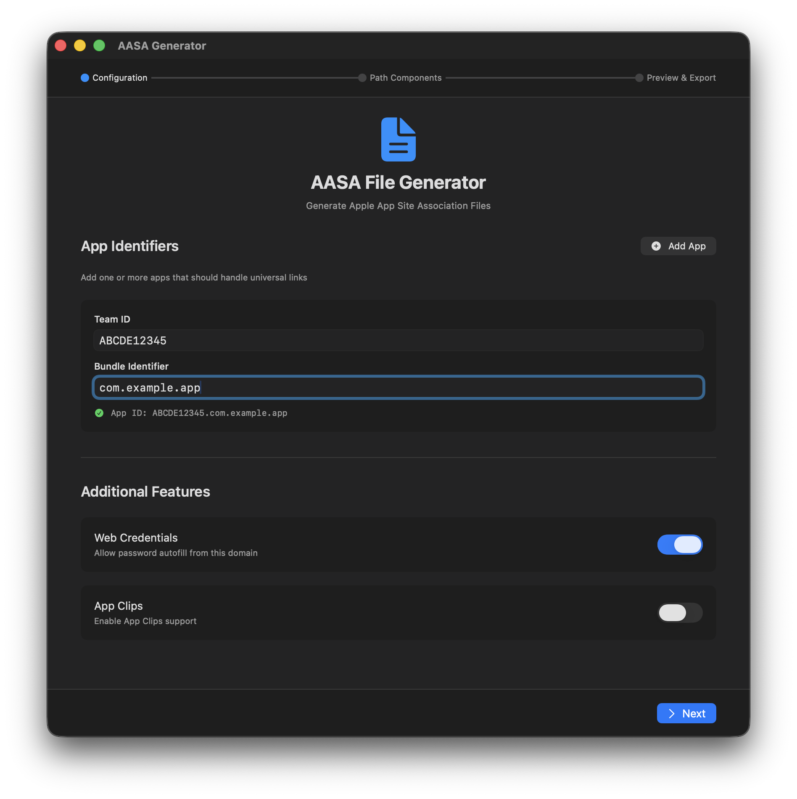
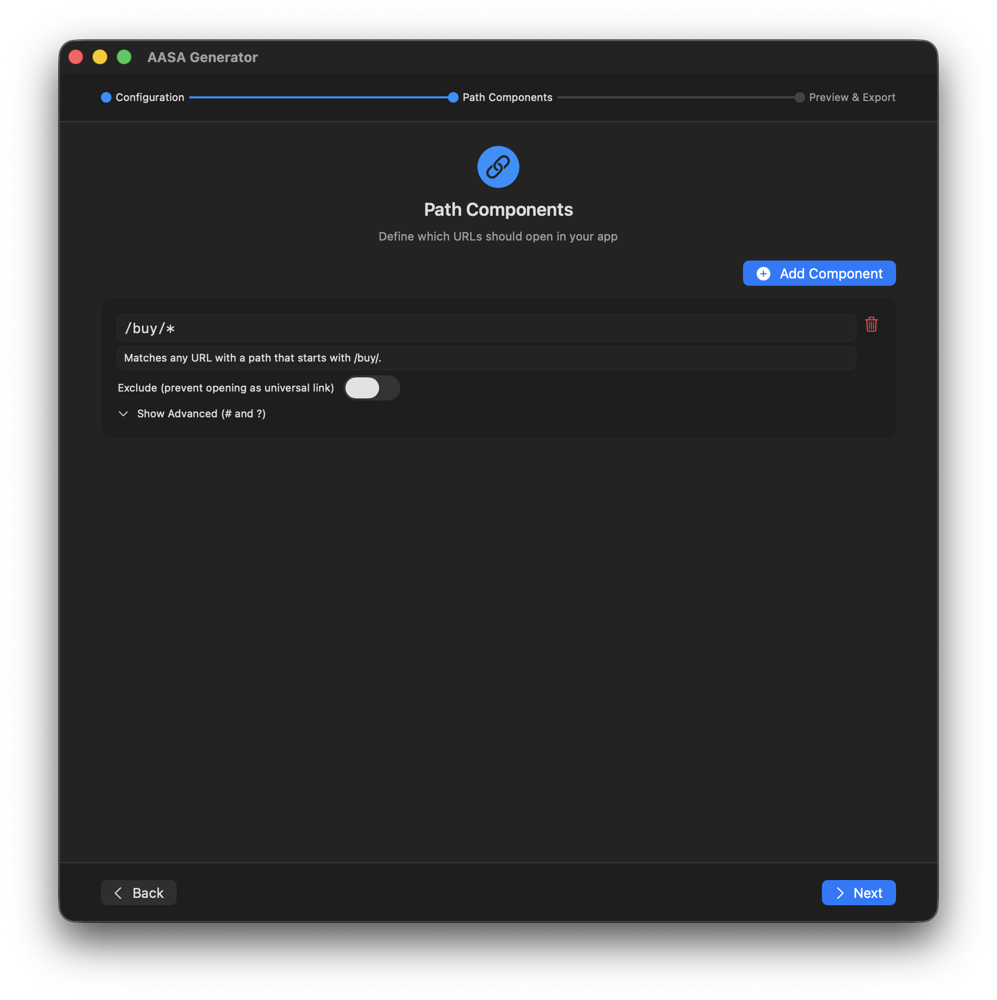
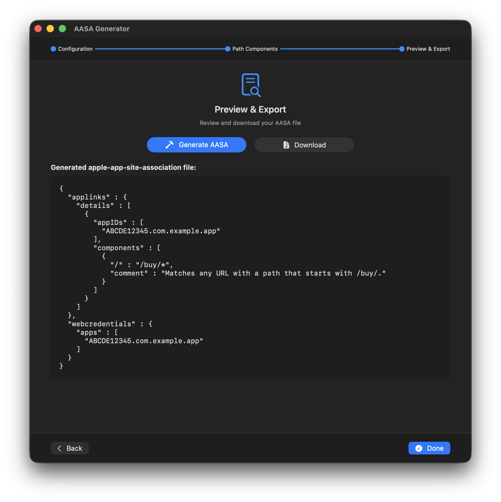

# AASA Generator

A macOS utility to generate **apple-app-site-association (AASA)** files for enabling **Universal Links** in iOS apps.

---

## 📦 Overview

**AASA Generator** is a lightweight macOS app designed to help iOS developers quickly create valid AASA files without errors. It supports multiple app identifiers, path rules, and allows instant preview before export.

---

## 🚀 Features

- Generate valid `apple-app-site-association` JSON files
- Support multiple app bundle identifiers
- Define multiple path rules (wildcards, specific paths, etc.)
- Real-time JSON preview
- Export ready-to-upload AASA files
- Clean and minimal macOS UI

---

## 🖥 Requirements

- macOS 15.6 or later

---

## 🛠 How to Use

1. Open **AASA Generator**  
2. Enter:
   - Team ID
   - Bundle Identifier(s)
   - Supported paths (e.g., `*`, `/products/*`)  
3. Preview the generated JSON  
4. Export the file  
5. Upload to your web server

---

## 📸 Screenshots

**Configuration Screen:**  

**Path Components:**  

**Export Option:**  

---

## License

[MIT](https://choosealicense.com/licenses/mit/)
